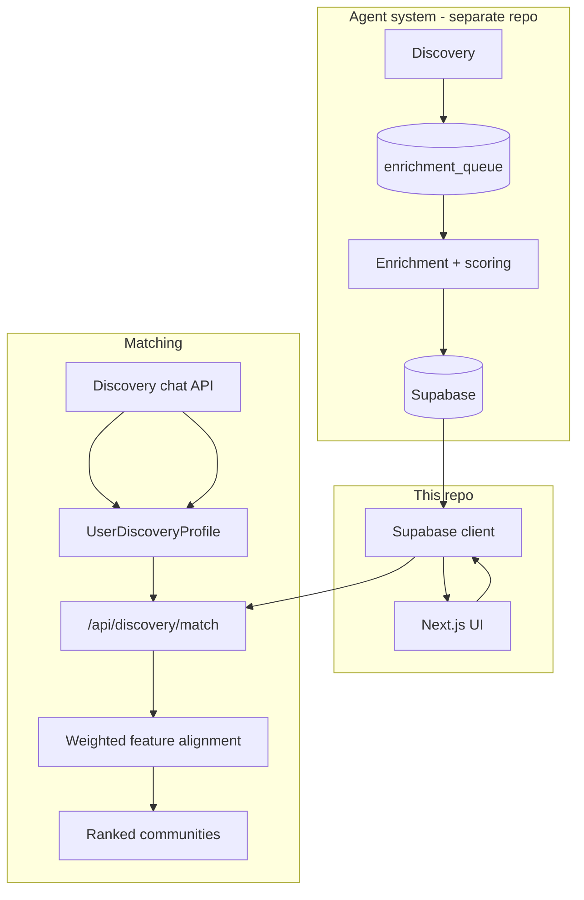

# Monastery Finder

A Next.js web app for discovering and comparing spiritual and intentional communities across the United States—monasteries, temples, zen centers, retreat centers, abbeys, convents, and similar places. Users explore communities on a map and list, read enriched profiles sourced from community websites, and get personalized matches through a guided discovery chat.

**Data pipeline:** Community records are produced by the [Monastery Finder Agent System](https://github.com/meredithvf/monastery-finder-agent-system#monastery-finder-agent-system) (discovery + enrichment LangGraph pipelines) and stored in Supabase. This repo is the **frontend and matching layer** only—it reads `communities`, `community_profiles`, and `community_scores` and does not run the enrichment graph.

**Schema reference:** [docs/DATABASE.md](docs/DATABASE.md) — tables, jsonb fields, legacy migration, and query patterns.

## Architecture



| Layer | Responsibility |
|-------|----------------|
| Agent system | Web search, crawl, LLM profile extraction, feature scoring, writes to Supabase |
| This app | Browse/search UI, discovery chat, user↔community matching, optional lightweight discovery script |
| Supabase | Postgres + jsonb for profiles and feature vectors |

## Features

### Browse

- **Home** (`/`) — Hero, discovery chat, profile summary, map preview
- **Map** (`/map`) — Mapbox map with clustered markers (requires coordinates)
- **List** (`/list`) — Filterable/sortable directory (tradition, cost, setting, beginner-friendly, search)
- **Community detail** (`/community/[id]`) — Full profile, website section summaries, feature score breakdown, map

### Discovery chat and matching

1. **Chat** (`POST /api/discovery/chat`) — A short open-ended conversation (one to four replies, ending early when the model has enough detail). Returns qualitative context via `submit_discovery_context` (summary, practical constraints, readiness narrative). The user then sets spectrum sliders and profile title on the home page (`DiscoveryPreferences`, `src/lib/discovery-sliders.ts`); the client merges into `UserDiscoveryProfile` (see `src/lib/discovery-profile.ts`).
2. **Match** (`POST /api/discovery/match`) — Loads all communities with `community_scores.feature_scores`, normalizes user preferences (0–100 spectrums) and community features (0–1), applies hard constraints (region, tradition, budget flags where set), scores weighted alignment, returns top N with explanations (`src/agents/matching/`).
3. **Results** (`/discovery/results`) — Displays ranked matches from session storage.

Profile titles: Curious explorer, Retreat seeker, Serious practitioner, Long-term communal living, Vocational/ordination interest.

## Data model (summary)

| Table | What this app uses it for |
|-------|----------------------------|
| `communities` | Identity, location, map coordinates |
| `community_profiles` | **`profile` jsonb** — descriptions, tags, website summaries |
| `community_scores` | Adjusted confidence + **`feature_scores` jsonb** for matching |

Full column lists, jsonb trees, legacy formats, and the Supabase select fragment: **[docs/DATABASE.md](docs/DATABASE.md)**.

## Project layout

```
docs/
  DATABASE.md                 # Supabase tables + jsonb reference
src/
  app/
    page.tsx                    # Home + discovery chat
    map/                        # Full map view
    list/                       # Directory + filters
    community/[id]/             # Detail page
    discovery/results/          # Match results
    api/discovery/
      chat/route.ts             # OpenAI discovery conversation
      match/route.ts            # Rank communities for a profile
  agents/matching/              # Constraints, normalization, ranking, explanations
  components/
    DiscoveryChat.tsx           # Chat UI + profile state
    communities/                # Map, cards, filters, score bars
  hooks/                        # Communities fetch, geolocation, filters
  lib/
    types/community.ts          # Profile + feature_scores TypeScript mirrors
    community-queries.ts        # Supabase fetch helpers
    community-transforms.ts     # Row → list item / match input
    website-content.ts          # Profile jsonb → flat website sections
    feature-scores.ts           # Parse + migrate feature_scores jsonb
    discovery-profile.ts        # User profile schema + OpenAI tool definition
    matching/                   # Keys, weights, alignment rules
scripts/
  discover-communities.mjs      # Optional LLM batch insert (communities only)
```

## Setup

**Requirements:** Node.js 20+, Supabase project with agent-system schema applied, OpenAI API key for discovery chat.

```bash
npm install
```

Create `.env.local`:

```bash
# Supabase (browser + server)
NEXT_PUBLIC_SUPABASE_URL=https://<project-ref>.supabase.co
NEXT_PUBLIC_SUPABASE_ANON_KEY=...

# Discovery chat + optional discover script (server only)
OPENAI_API_KEY=sk-...
OPENAI_MODEL=gpt-4o-mini          # optional; chat route default

# Map (optional; map pages degrade without token)
NEXT_PUBLIC_MAPBOX_ACCESS_TOKEN=pk....
```

For `npm run discover:communities` only (uses service role—never expose in the client):

```bash
SUPABASE_URL=...
SUPABASE_SERVICE_KEY=...
```

```bash
npm run dev      # http://localhost:3000
npm run build
npm run lint
```

## Scripts

| Command | Description |
|---------|-------------|
| `npm run dev` | Next.js dev server |
| `npm run build` | Production build |
| `npm run start` | Production server |
| `npm run lint` | ESLint |
| `npm run discover:communities` | Standalone script: LLM proposes US communities, inserts missing `communities` rows (dedupe by website host). Does **not** run enrichment or write profiles/scores. |

For full discovery → enrichment → profiles/scores, use the [agent system](https://github.com/meredithvf/monastery-finder-agent-system#monastery-finder-agent-system) (`npm run discovery`, `npm run enrich` in that repo).

## Matching (implementation summary)

- User spectrums: 0–100 in `UserDiscoveryProfile` → normalized to 0–1 in `src/lib/matching/normalize.ts`.
- Community values: `feature_scores.features` paths in `src/lib/matching/feature-keys.ts`.
- Alignment: `ALIGNMENT_RULES` in `src/lib/matching/alignment.ts` map user preference keys to community feature keys (with optional inversion).
- Hard filters: region, tradition, and related constraints in `src/agents/matching/matcher.ts`.
- List cards use `adjusted_overall` from `community_scores` when present; legacy `composite_score` inside old `feature_scores` is still supported.

## Documentation

| Doc | Contents |
|-----|----------|
| [README.md](README.md) | App overview, setup, routes, matching summary |
| [docs/DATABASE.md](docs/DATABASE.md) | Supabase tables, jsonb schemas, legacy migration, queries |
| [Agent system](https://github.com/meredithvf/monastery-finder-agent-system#monastery-finder-agent-system) | Discovery/enrichment pipelines, DDL, CLI |

## Keeping docs accurate

Update docs in the **same PR** as code changes (see `.cursor/rules/readme-sync.mdc`):

- **Schema / jsonb** → `docs/DATABASE.md` + `src/lib/types/community.ts`
- **App behavior, setup, routes** → `README.md`
