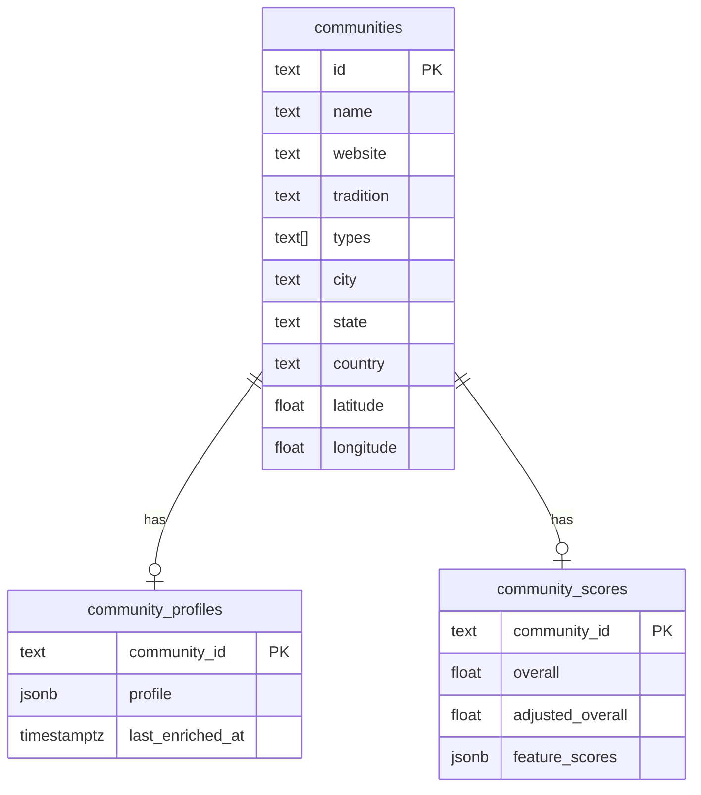

# Database schema

Supabase (Postgres) stores community data produced by the [Monastery Finder Agent System](https://github.com/meredithvf/monastery-finder-agent-system#monastery-finder-agent-system). DDL and migrations live in that repo under `supabase/` (`schema.sql`, `discovery_tables.sql`, `community_pages.sql`, etc.).

This document describes tables and **jsonb** shapes as consumed by **this** frontend. TypeScript mirrors: `src/lib/types/community.ts`.

## Overview



| Table | Queried by this app | Written by |
|-------|---------------------|------------|
| `communities` | Yes | Agent enrichment, optional `discover-communities.mjs` (identity only) |
| `community_profiles` | Yes | Agent enrichment |
| `community_scores` | Yes | Agent enrichment |
| `discovered_entities` | No | Agent discovery |
| `enrichment_queue` | No | Agent discovery |
| `community_pages` | No | Agent enrichment (per-page crawl) |
| `discovery_jobs`, `discovery_results`, `discovery_metrics` | No | Agent discovery batch |

## `communities`

Relational columns for listing, maps, and filters. Enrichment copies values from the LLM profile’s `coreIdentity` and `geographic`, then **strips** `website` and `geographic` from `community_profiles.profile` before insert.

| Column | Type | Notes |
|--------|------|--------|
| `id` | `text` | Primary key (slug-style id from enrichment) |
| `name` | `text` | Display name |
| `website` | `text` | Canonical URL |
| `tradition` | `text` | e.g. Zen, Benedictine |
| `types` | `text[]` | `monastery`, `zen_center`, `temple`, `convent`, `abbey`, `retreat_center`, `intentional_community`, `other` |
| `city`, `state`, `country` | `text` | US-focused; country often `US` |
| `latitude`, `longitude` | `float` | Nullable; map views filter on non-null |
| `created_at` | `timestamptz` | Optional |

| Enrichment source | Column(s) |
|-------------------|-----------|
| `coreIdentity` | `name`, `website`, `tradition`, `types` |
| `geographic` | `city`, `state`, `country`, `latitude`, `longitude` |

The UI may fall back to `profile.geographic.coordinates` when row lat/lng are null (`src/lib/community-transforms.ts`).

## `community_profiles`

| Column | Type | Notes |
|--------|------|--------|
| `community_id` | `text` | FK → `communities.id` |
| `profile` | **jsonb** | Unified enriched profile (see below) |
| `last_enriched_at` | `timestamptz` | Pipeline timestamp |

### `profile` jsonb — stored shape

After enrichment persist, these fields are **not** in jsonb (read from `communities` instead):

- `coreIdentity.website` → `communities.website`
- `geographic` (city, state, country, coordinates, `ruralUrban`, etc.) → `communities` columns; `ruralUrban` may still appear in older rows’ jsonb until re-enriched

### Top-level sections

| Key | Purpose |
|-----|---------|
| `coreIdentity` | `id`, `name`, `types[]`, `tradition`, optional `affiliation` |
| `display` | Description, tags, hero image, website section text, etiquette |
| `practice` | Daily life, practice style, atmosphere |
| `accessibility` | Beginner-friendly, logistics, website summaries for stays |
| `fitSignals` | `bestFor`, `notSuitableFor` |
| `confidence` | `overall`, `dataCompleteness`, `sourceQuality`, optional `inferenceLevel` (0–1) |
| `evidence` | `sources[]`, optional `fieldEvidence[]` |

### `display`

| Field | Type | UI use |
|-------|------|--------|
| `description` | string | Short / long description |
| `tags` | string[] | List filters, cards |
| `imageUrl` | string? | Hero image |
| `summaryTagline` | string? | Card subtitle, image alt |
| `homepage` | string? | Website section |
| `about` | string? | Website section |
| `etiquette` | object? | `dressCode`, `communicationStyle`, `behaviorNotes`, `guidelines` |
| `lastEnrichedAt` | string? | ISO timestamp (may duplicate column) |

### `practice`

| Path | Notes |
|------|--------|
| `dailyLife.scheduleSummary` | Schedule website section |
| `dailyLife.silenceLevel` | `low` \| `medium` \| `high` \| `unknown` |
| `dailyLife.workPractice`, `typicalDay` | Optional text |
| `practiceStyle.meditationIntensity`, `ritualLevel` | Level enums |
| `practiceStyle.studyVsPractice` | `study` \| `balanced` \| `practice-heavy` \| `unknown` |
| `communityAtmosphere.tone`, `communalityLevel` | Tone / level enums |

### `accessibility`

| Path | Notes |
|------|--------|
| `beginnerFriendly` | `yes` \| `no` \| `mixed` \| `unknown` |
| `englishSupport`, `culturalBarrier`, `applicationDifficulty`, `stayFlexibility` | Optional tri-state / level |
| `retreats`, `programs`, `pricing`, `residency`, `visitorInfo` | Website summary strings |
| `logistics.cost` | `{ min, max, currency }` |
| `logistics.stayOptions` | `retreat`, `short_term`, `long_term`, `resident`, `volunteer` |
| `logistics.housingAvailable` | `yes` \| `no` \| `limited` \| `unknown` |

### `fitSignals`

| Field | Type |
|-------|------|
| `bestFor` | string[] |
| `notSuitableFor` | string[] |

### Website summaries → UI (`src/lib/website-content.ts`)

| UI field (`CommunityWebsiteContent`) | Profile path |
|--------------------------------------|----------------|
| `about` | `display.about` |
| `guidelines` | `display.etiquette.guidelines` |
| `schedule` | `practice.dailyLife.scheduleSummary` |
| `retreats` | `accessibility.retreats` |
| `programs` | `accessibility.programs` |
| `pricing` | `accessibility.pricing` |
| `residency` | `accessibility.residency` |
| `visitorInfo` | `accessibility.visitorInfo` |
| `homepage` | `display.homepage` |
| `primaryImage` | `display.imageUrl` (+ alt from `summaryTagline` or name) |

### Legacy `profile` keys

Older enrichment rows may include top-level `websiteContent`, `websiteSections`, or `practicalFit`. `extractWebsiteSummaries()` prefers unified paths above and falls back to these blobs.

### Agent synthesis mapping (enrichment pipeline)

When the backend merges crawl text into the profile tree:

| Synthesis field | Profile path |
|-----------------|--------------|
| `tags` | `display.tags` |
| `guidelines` | `display.etiquette.guidelines` |
| `about` | `display.about` |
| `schedule` | `practice.dailyLife.scheduleSummary` |
| `retreats`, `programs`, `pricing`, `residency`, `visitorInfo` | `accessibility.*` |
| `bestFor`, `notSuitableFor` | `fitSignals` |
| Hero image | `display.imageUrl` |

Raw per-page crawl text is stored in `community_pages` (backend only), not in `profile` jsonb.

## `community_scores`

| Column | Type | Notes |
|--------|------|--------|
| `community_id` | `text` | FK → `communities.id` |
| `overall`, `data_completeness`, `source_quality` | `float` | Raw model confidence |
| `inference_level` | `float` | Nullable |
| `adjusted_overall`, `adjusted_data_completeness`, `adjusted_source_quality`, `adjusted_inference_level` | `float` | After validation penalties |
| `feature_scores` | **jsonb** | LLM feature extraction for matching (see below) |
| `updated_at` | `timestamptz` | Optional |

List UI uses `adjusted_overall` when present (`src/lib/community-transforms.ts`).

### `feature_scores` jsonb — canonical shape

Mirrors backend `communityFeatureExtractionSchema`. All feature values are **0–1** unless noted; **0.5 = neutral / not mentioned**. Binary fields are **0** or **1**.

```json
{
  "name": "Example Zen Center",
  "website_summary": "Urban meditation center offering weekend retreats.",
  "features": {
    "practice": {
      "meditation_intensity": 0.7,
      "silence_level": 0.6,
      "study_vs_practice_balance": 0.5
    },
    "community": {
      "communal_living_strength": 0.4,
      "residential_option_available": 0,
      "long_term_residency_supported": 0,
      "guest_stay_supported": 1,
      "lay_friendly_vs_monastic_oriented": 0.5
    },
    "social": {
      "social_interaction_level": 0.5,
      "community_size_estimate": 0.5
    },
    "accessibility": {
      "beginner_friendly": 0.9
    },
    "budget": {
      "budget": 0.5,
      "scholarship_available": 0.2,
      "volunteer_work_exchange_available": 0.3
    },
    "lifestyle": {
      "urban_vs_rural": 0.6,
      "spartan_vs_comfortable": 0.5,
      "daily_structure_rigidity": 0.5,
      "digital_friendly_vs_unplugged": 0.5
    },
    "spiritual_orientation": {
      "contemplative_vs_devotional": 0.6,
      "mystical_vs_intellectual": 0.5,
      "traditional_vs_modern": 0.4
    },
    "readiness": {
      "seriousness_level": 0.5
    }
  },
  "signals": {
    "explicit_quotes": ["All levels welcome."],
    "extraction_confidence": 0.75,
    "missing_data_fields": ["features.budget.budget"]
  }
}
```

### Feature groups (matching)

| Group | Fields | Semantics (selected) |
|-------|--------|----------------------|
| `practice` | `meditation_intensity`, `silence_level`, `study_vs_practice_balance` | Continuous 0–1 |
| `community` | `communal_living_strength`, `residential_option_available`, `long_term_residency_supported`, `guest_stay_supported`, `lay_friendly_vs_monastic_oriented` | Last four: 0/1 or 0–1; lay vs monastic: 0 = lay-friendly, 1 = monastic |
| `social` | `social_interaction_level`, `community_size_estimate` | Continuous |
| `accessibility` | `beginner_friendly` | Continuous |
| `budget` | `budget`, `scholarship_available`, `volunteer_work_exchange_available` | `budget`: 0 = free/donation, 1 = expensive |
| `lifestyle` | `urban_vs_rural`, `spartan_vs_comfortable`, `daily_structure_rigidity`, `digital_friendly_vs_unplugged` | `urban_vs_rural`: 0 = urban, 1 = rural |
| `spiritual_orientation` | `contemplative_vs_devotional`, `mystical_vs_intellectual`, `traditional_vs_modern` | Continuous |
| `readiness` | `seriousness_level` | 0 = casual, 1 = rigorous |

`signals.explicit_quotes`, `signals.extraction_confidence`, `signals.missing_data_fields` are metadata, not used in distance scoring.

### Legacy `feature_scores`

`parseFeatureScores()` in `src/lib/feature-scores.ts` handles:

1. **Flat legacy** — e.g. `meditation_intensity`, `beginner_friendly_score`, `cost_affordability`, `composite_score` at top level
2. **Partial nested** — e.g. `features.cost` renamed to `features.budget`; missing `spiritual_orientation` / `readiness` filled with `0.5`

List cards expose derived metrics: `beginner_friendly` → score bar, `1 - budget` → cost affordability, `urban_vs_rural` → setting score.

## Query pattern (this app)

```typescript
// src/lib/community-select.ts
const COMMUNITY_SELECT = `
  *,
  community_profiles ( community_id, profile, last_enriched_at ),
  community_scores (
    community_id,
    overall,
    data_completeness,
    source_quality,
    inference_level,
    adjusted_overall,
    adjusted_data_completeness,
    adjusted_source_quality,
    adjusted_inference_level,
    feature_scores,
    updated_at
  )
`;
```

Used by `src/lib/community-queries.ts` for list, detail, and discovery match.

## Backend-only tables (reference)

Documented in the [agent system README](https://github.com/meredithvf/monastery-finder-agent-system#monastery-finder-agent-system); not read by this app.

| Table | Role |
|-------|------|
| `community_pages` | Per-page crawl: `url`, `page_type`, `title`, `raw_content`, `cleaned_content`, `extracted_headings`, `content_hash` |
| `discovered_entities` | Discovery payload jsonb keyed by `entity_id` |
| `enrichment_queue` | Pending enrichment jobs |
| `discovery_jobs`, `discovery_results`, `discovery_metrics` | Batch discovery scheduling and MDR metrics |
| `coverage_view` | Derived coverage from metrics |

## Keeping this document accurate

Update **`docs/DATABASE.md`** together with **`src/lib/types/community.ts`** when:

- `community_profiles.profile` or `community_scores.feature_scores` shape changes
- `src/lib/community-select.ts` adds/removes columns
- `src/lib/website-content.ts` path mapping changes
- This app starts querying a new table

Also update the root `README.md` if setup or high-level architecture changes. See `.cursor/rules/readme-sync.mdc`.
